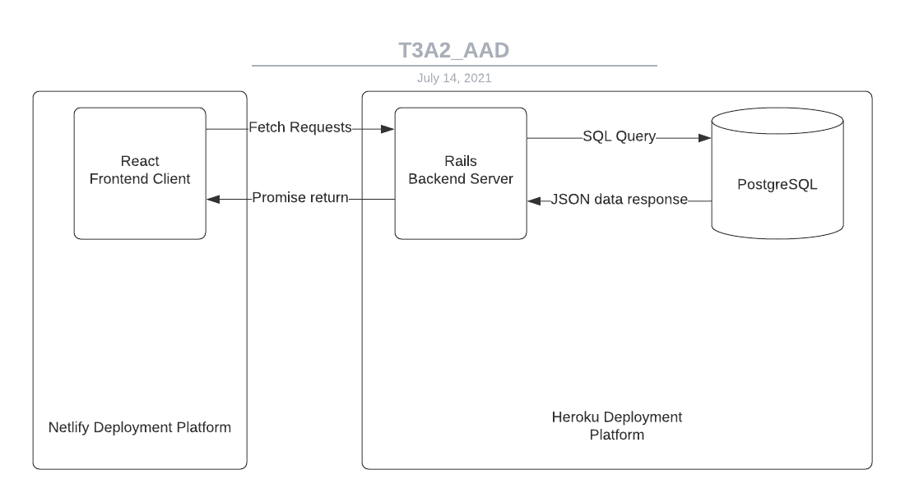

## Description of your website, including:
### Purpose
The application concept chosen is an application that provides parents a checklist for the various medications that their children may have to take. The main purpose of the application is to ensure that the children are taking their medication. 

The application also has a sub purpose of building good habits within the users by utilising positive reinforcement via a rewards system. 
### Functionality / features
MVP
- Login (Username, email, password)
- Allows parents to view all listed medication
- Allows parents to add medicine information
- Multiple Childs for each parent user
- Parents can create a checklist
- Parents can modify an existing checklist
- Reward system
- Reminder system

Extras
- Image upload system
- Pushing reminders via email and mobile notifications (add PhoneNumber to User)
- Parental controls (lock down everything except checklist)
- Parents can view reward history

### Target audience
The target audience for the application will be parents. Specifically parents with kids that need medicine. Due to parents quite often being busy with other their careers or other errands that they need to run, remembering the specific times that their children's medication needs to be taken, and following up with it can escape them. Hence with an application that acts as a checklist and pushes notifications to them will be highly advantageous to them. 

### Tech stack

The tech-stack that will be utilised in the project will focus on the use of Ruby on Rails, in an api format for the backend functions of the application. 

For the front-end functions of the application, the framework React will be utilised to make a component based scaffold. 

The web-hosting service used for the application will be the free service Heroku. This was decided due to the teams previous experience with the service and easily integrated terminal or console tool that Heroku utilises for deployment purposes. 

In terms of source control software, Github has been chosen as the available features of the service matches what is required for the project to be successful. The developers on the team also have a moderate amount of experience using Github as a source control system adding more reason to use it. 

Due to the project having a possible feature of utilising image upload, an image storage method needs to be considered. Upon discussion within the team, the best choice was deemed to be the cloud storage service Cloudinary. This is primarily due to the fact that this has been used in the past with previous projects and has shown reliability when it has been used. 

## Dataflow Diagrams
<!-- CMP1043-4.2 Dataflow Diagram - Provides dataflow diagram(s) that strictly follow the standard convensions to clearly identify the processes within your application. Clearly depicts where data is coming from, where it is going and how it is being stored. -->

### User Functions

### Child Functions

## Application Architecture Diagram
<!-- CMP1043-4.3 Application Architecture Diagram - Shows understanding of the high level structure of the app -->

## User Stories
<!-- CMP1043-5.1 Provide UX/UI design documentation(user stories) that adequately show Agile methodology implementation. - Provides multiple user stories that use ‘persona, what and why’ that outline meaningful features of project. Shows evidence of user story revision and refinement. -->
MVP
- As a parent, I want a Login system so I can login and see the various information on any device whilst i am on the go.
- As a parent, I want to add medicine to the list if it does not already exist, in order to keep the list accurate.
- As a parent i would like to be able to have a separate list for each of my children, so i can easily track everyone in my family
- As a Parent, I want to make a medicine checklist in order to allow my children to take their medicine.
- As a kid, I want to have an understandable description of what the medicine does, so I can know why I am taking it.
- As a kid, I want a Reward system to give me incentive to take my medicine.
- As a parent, I want a Reminder system so I can be told if my kids have not had their medicine.

Extras
- As a parent/kid, I would like to have an Image of the medicine so I know what the medicine looks like
- As a busy parent, I would like the reminders to be sent to my mobile, so I can still receive them on the go.
- As a parent, I want to stop the children from accessing the editing features in order to stop them from changing the checklists.
- As a parent, I want to be able to look up the reward history to see if my children have been taking their medicine.
- As a parent/user i would like to be able to sign up using my google account, as it makes it easier to access, and manage my data and what has access to it. 

## Wireframes for multiple standard screen sizes, created using industry standard software

<!-- CMP1043-4.1 Utilise an industry standard program for creation of wireframes & CMP1043-5.3 Provide UX/UI design documentation(wireframes) that adequately show Agile methodology implementation. - Provides wireframes that show exceptional planning of project flow and structure including but not limited to space distribution, content prioritisation, intended actions, functions, relationships between screens. -->

## [Screenshots of your Trello board throughout the duration of the project](https://trello.com/b/knoPp8L3/coderacademyt3a2)
<!-- CMP1043-5.2 Select and follow a commonly used planning methodology, such as Kanban, Trello, Jira, or Asana. - Simple and clear standards for planning methodology chosen and adhered to -->

### 08/07/2021

### 13/07/2021

